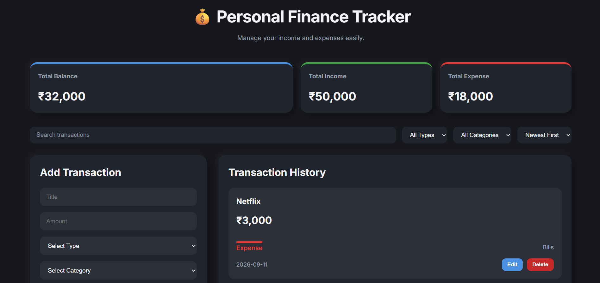

# 💰 Personal Finance Tracker

A responsive Personal Finance Tracker built using HTML, CSS, and JavaScript. It allows users to manage their income and expenses with a clean interface while storing data locally in the browser.

---

## 🚀 Features

- Add new transactions
- Edit existing transactions
- Delete transactions
- Real-time balance calculation
- Income and expense summary
- Search transactions by title
- Filter by transaction type
- Filter by category
- Sort by newest or oldest
- Data persistence using Local Storage
- Responsive design for desktop, tablet, and mobile

---

## 🛠️ Technologies Used

- HTML5
- CSS3
- JavaScript
- Local Storage

---

## 📂 Project Structure

```
Personal-Finance-Tracker/
│
├── index.html
├── README.md
│
├── css/
│   ├── style.css
│   └── responsive.css
│
└── js/
    └── script.js
```

---

## 📸 Screenshots

_Add screenshots of the application here._

### Dashboard




---

## ⚙️ How to Run

1. Clone the repository

```bash
git clone <repository-url>
```

2. Open the project folder.

3. Open `index.html` in your browser.

No additional installation is required.

---

## 📖 What I Learned

While building this project I practiced:

- DOM Manipulation
- Event Handling
- JavaScript Objects and Arrays
- CRUD Operations
- Local Storage
- Array Methods (`filter`, `find`, `findIndex`, `sort`, `forEach`)
- Responsive Design using CSS Grid and Flexbox
- Building a complete front-end application from scratch

---

## 🔮 Future Improvements

- Dark / Light theme toggle
- Charts and expense analytics
- Monthly budgeting
- User authentication

---

## 👨‍💻 Author

**Archit Singhal**
